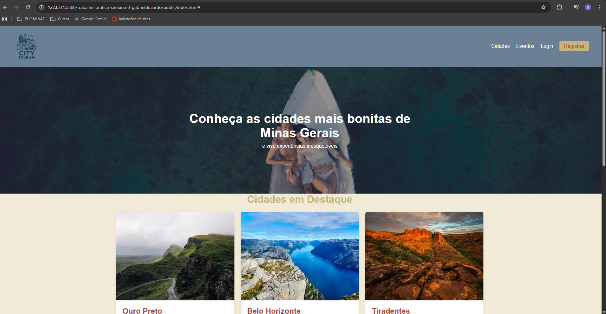
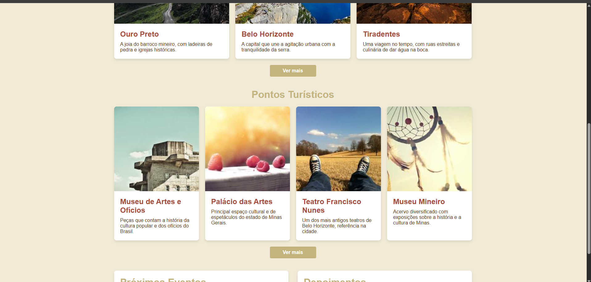
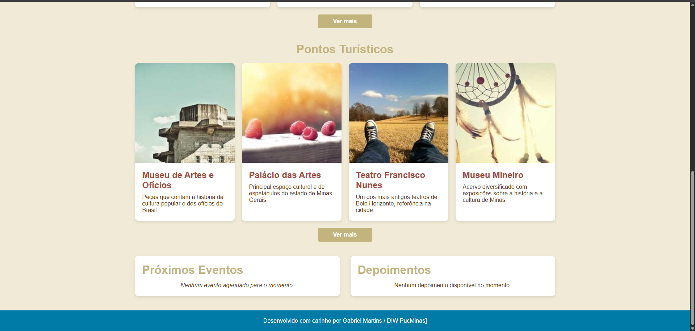
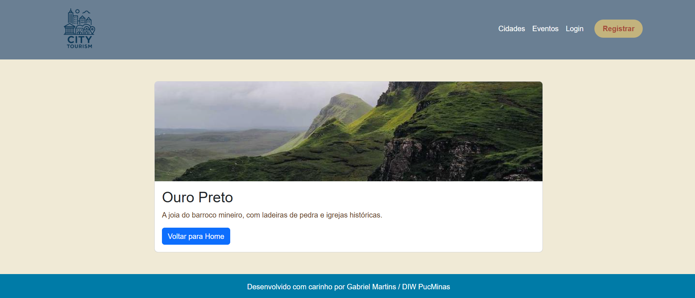

# Trabalho Prático 05 - Semanas 7 e 8

**Páginas de detalhes dinâmicas**

Nessa etapa, vamos evoluir o trabalho anterior, acrescentando a página de detalhes, conforme o  projeto escolhido. Imagine que a página principal (home-page) mostre um visão dos vários itens que existem no seu site. Ao clicar em um item, você é direcionado pra a página de detalhes. A página de detalhe vai mostrar todas as informações sobre o item do seu projeto. seja esse item uma notícia, filme, receita, lugar turístico ou evento.

Leia o enunciado completo no Canvas. 

**IMPORTANTE:** Assim como informado anteriormente, capriche na etapa pois você vai precisar dessa parte para as próximas semanas. 

**IMPORTANTE:** Você deve trabalhar e alterar apenas arquivos dentro da pasta **`public`,** mantendo os arquivos **`index.html`**, **`styles.css`** e **`app.js`** com estes nomes, conforme enunciado. Deixe todos os demais arquivos e pastas desse repositório inalterados. **PRESTE MUITA ATENÇÃO NISSO.**

## Informações Gerais

- Nome: Gabriel Eduardo de Oliveira Martins
- Matricula:
- Proposta de projeto escolhida: A proposta que escolhi é criar um site para mostrar um pouco das cidades mineiras, e sugerir locais como parques, museus e teatros para que a populção possa conhecer.
- Breve descrição sobre seu projeto: A ideia do meu projeto é de criar um site onde a população mineira possa conhecer mais sobre o Estado, conhecer novas cidades, museus, teatros, parques, e possa ser avisada onde vai ver eventos. 

## Print da Home-Page

  
  
  

## Print da página de detalhes do item

 


## Cole aqui abaixo a estrutura JSON utilizada no app.js

```javascript
// app.js

// Dados simulados (poderia vir de uma API futuramente)
const cidades = [
  {
    id: 1,
    nome: "Ouro Preto",
    imagem: "https://picsum.photos/id/1018/800/600",
    descricao: "A joia do barroco mineiro, com ladeiras de pedra e igrejas históricas."
  },
  {
    id: 2,
    nome: "Belo Horizonte",
    imagem: "https://picsum.photos/id/1015/800/600",
    descricao: "A capital que une a agitação urbana com a tranquilidade da serra."
  },
  {
    id: 3,
    nome: "Tiradentes",
    imagem: "https://picsum.photos/id/1016/800/600",
    descricao: "Uma viagem no tempo, com ruas estreitas e culinária de dar água na boca."
  }
];

// Função para pegar parâmetros da URL
function getQueryParam(param) {
  const urlParams = new URLSearchParams(window.location.search);
  return urlParams.get(param);
}

// Página de detalhes
if (window.location.pathname.includes("detalhes.html")) {
  const id = parseInt(getQueryParam("id"));
  const item = cidades.find(c => c.id === id);

  if (item) {
    document.getElementById("detalhe-item").innerHTML = `
      <div class="col-md-8">
        <div class="card">
          
          <div class="card-body">
            <h2 class="card-title">${item.nome}</h2>
            <p class="card-text">${item.descricao}</p>
            <a href="index.html" class="btn btn-primary">Voltar para Home</a>
          </div>
        </div>
      </div>
    `;
  } else {
    document.getElementById("detalhe-item").innerHTML = `
      <p class="text-center text-danger">Item não encontrado.</p>
    `;
  }
}

```